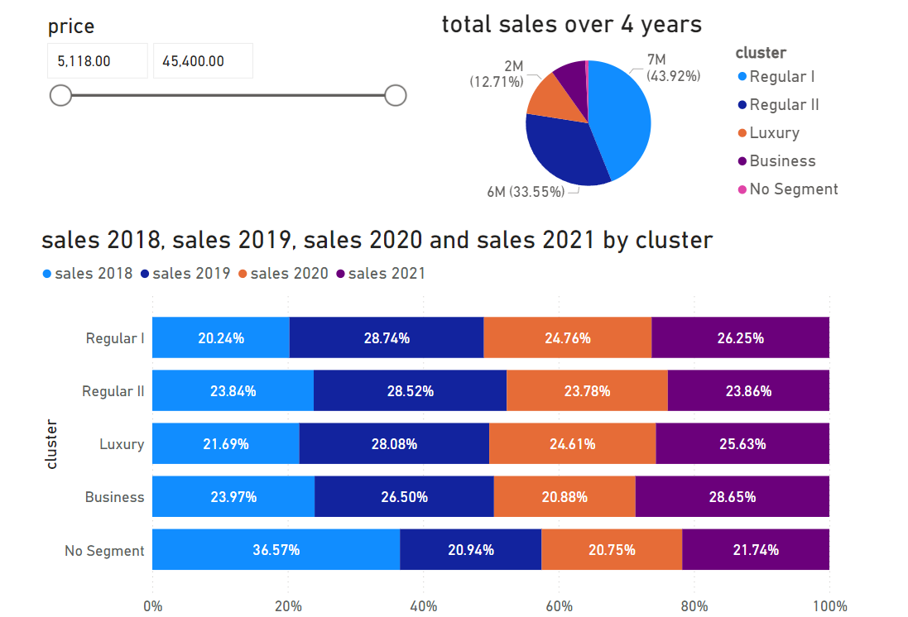

# Microsoft Engage 2022
# 
## The Challenge
Develop an application to demonstrate how the Automotive Industry could harness data to take informed decisions. Demonstrate the use of data analytics in identifying:
Customer segments, Most popular car specification combination (engine type, fuel, mileage, etc), Right time to launch a new car, etc
Any other queries you can think of
## Development Methodology 
* I divided the project into 3 phases : research, basic working prototype, addition of features.
* In the research phase I began by selecting a dataset from <a href="https://www.kaggle.com">Kaggle</a>. Then I learnt how to use Power BI and plotted some basic graphs to try out different possibilities.
* In the second phase, I started developing the React app. I started with the data analysis part simultaneously as well. I made some basic reports on Power BI and embedded them into the React application. I divided the cars into 5 customer segments using the K-Means algorithm. By the end of this phase I had a working application with a responsive front-end.
* In the last phase I completed all the 5 reports and started out with the Sales Prediction part. After some research I was able to implement Linear Regression to predict sales based on independent input variables.
* Once the model was working I implemented basic functionalities in javascript to compute the expected sales using the Linear Regression model when the user provides car specifications.

### To run the application on your local machine do the following : 
Please note that you will need node.js installed on your machine to run this project.

1. open the terminal in "Data Analysis Project" folder.
2. type `cd automobile_industry_analysis` in the terminal and press enter.
3. type `npm i` in the terminal and press enter. Wait for the packages to download and install.
4. finally enter `npm start` in the ternminal to run the app on port 3000.

## Data Set
### This project uses a data set consisting of various features like price, sales, horsepower, curbweight, mileage, etc. of 205 cars. 

link to the data set: <a href="https://1drv.ms/x/s!AkSxQvIzIp7WkYwOehfepRWpe56ZTQ?e=G2KtMA">Data Set</a>

One of the also use an additional <a href="https://www.factorywarrantylist.com/car-sales-by-country.html">list</a> of countrywise sales. This list is also present as a separate sheet in the above provided excel file.

## Data Cleaning
Python's Pandas library has been used for data cleaning. All the code is present in ./data/data_cleaning.ipynb
Some of the cars had missing sales data so those were removed from the data set to make another data set named 'dataset_after_cleaning/xlsx' present at ./data/Datasets/dataset_after_cleaning/xlsx 

## Feature Engineering

### Used K-Means algorithm to divide the set of 205 cars into 5 Customer Segments.

1. used one-hot encoding for features with non integer values like carbody type, fuel, etc.
2. ran k-means clustering on the dataset
3. identified each cluster as a customer segment based on it's unique feature sets.
4. The following 5 customer segments were identified : 'Regular I', 'Regular II', 'Business', 'Luxury' and 'No Segment'. 
5. The cars belonging to 'No Segment' are the ones which don't fit into any of the other 4 segments. These have the common property of relatively low sales. 
#### All the code is present in ./data/model_training_K_Means.ipynb

## Sales Prediction with Linear Regression
The Sales prediction feature is implemented on top of a Linear Regression model. The model was trained on the given dataset of 205 cars and uses a total of 15 features, like curbweight, doornumber, enginetype, fuel, etc. as independent variables that are linearly affecting the sales of the car which in this case is our dependent variable.
#### All the code is present in ./data/linear_regression.ipynb

## Data Modeling
The React Application renders 5 Power BI reports each aimed at analysing the data from a different perspective (like sales, primary features, etc.). Power BI reports have been embedded into the webpage using the 'Publish to Web' service provided by Power BI. These embeds support fully interactive graphs and plots equipped with features like data slicing. All the inferences drawn from a particular Power BI report are summarized on it's side (on pc) or just below it (on phone). Each report consists of multiple dashboards. The slider window contains one slide for each dashboard in the same order. Therefore to view the inferences for a certain dashboard number (let's say x) the user needs to navigate to the same slide number (that is x) in the slider window. Each report is also accompained by a description on top of the inferences slider window which provides a basic insight into the objective of the report.

## Which Technology and Why

### React.js
The web application is built on <a href="https://reactjs.org/">React.js</a> which is javascript library. React provides with efficient ways to create interactive UIs and renders just the right components when the data changes. Partitioning the code into components helps in debugging. Instead of rewriting the code for each report, the same report component is re-rendered with different props (which are like arguments in a function) using react. 

### Power BI
<a href="https://powerbi.microsoft.com/en-au/">Power BI</a> is a data visualization tool and an industry standard for plotting interactive graphs to analyse data. All the reports were prepared in Power BI and then published on to the web and then embedded in the React application. These reports are interactive and provide a deep insight into the data.

### Python 
Python provides a vast number of inbuilt libraries which are extensively used for Data Analysis and Machine Learning. This project makes use of <a href="https://scikit-learn.org/stable/">sklearn</a>, <a href="https://numpy.org/">numpy</a> and <a href="https://pandas.pydata.org/">pandas</a>. Pandas was used for data cleaning, feature engineering and model training. Linear Regression was implemented using the sklearn library. 
